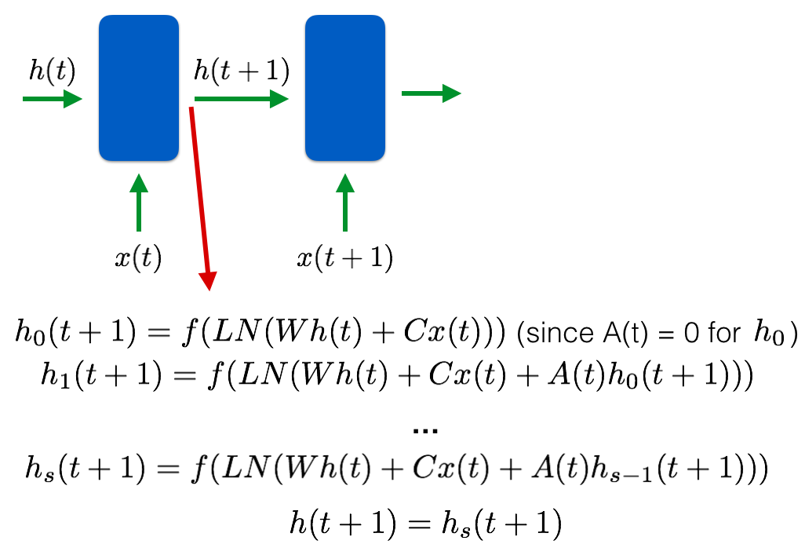
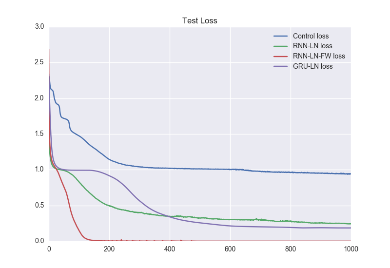

# Implementation of Using Fast Weights to Attend to the Recent Past
```
Using Fast Weights to Attend to the Recent Past
Jimmy Ba, Geoffrey Hinton, Volodymyr Mnih, Joel Z. Leibo, Catalin Ionescu
NIPS 2016, https://arxiv.org/abs/1610.06258
```

Use fast weights to aid in learning associative tasks and store temporary memories of recent past. In a traditional recurrent architecture we have our slow weights which are used to determine the next hidden state and hold long-term memory. We introduce the concept of fast weights, in conjunction with the slow weights, in order to account for short-term knowledge. These weights are quick to update and decay as they change from the introduction of new hidden states. 

### Physiological Motivations

How do we store memories? We don't store memories by keeping track of the exact neural activity that occurred at the time of the memory. Instead, we try to recreate the neural activity through a set of associative weights which can map to many other memories as well. This allows for efficient storage of many memories without storing separate weights for each instance. This associative network also allows for associative learning which is the ability to learn the recall the relationship between initially unrelated instances.(1)


### Concept
- In a traditional recurrent architecture we have our slow weights. These weights are used with the input and the previous hidden state to determine the next hidden state. These weights are responsible for the long-term knowledge of our systems. These weights are updated at the end of a batch, so they are quite slow to update and decay.

- We introduce the concept of fast weights, in conjunction with the slow weights, in order to account for short-term knowledge. These weights are quick to update and decay as they change from the introduction of new hidden states. 

- For each connection in our network, the total weight is the sum of the results from both the slow and fast weights. The hidden state for each time step for each input is determined by the operations with the slow and fast weights. We use a fast memory weights matrix A to alter the hidden states to keep track of the features required for any associative learning tasks.

- The fast weights memory matrix, A(t), starts with 0 at the beginning of the sequence. Then all the inputs for the time step are processed and A(t) is updated with a scalar decay with the previous A(t) and the outer product of the hidden state with a scalar operation with learning rate eta.


- For each time step, the same A(t) is used for all the inputs and for all S steps of the "inner loop". This inner loop is transforming the previous hidden state h(t) into the next output hidden state h(t+1). For our toy task, S=1 but for more complicated tasks where more associate learning is required, we need to increase S.



### Execution

- To see the advantage behind the fast weights, Ba et. al. used a very simple toy task.

Given: g1o2k3??g we need to predict 1. 
- You can think of each letter-number pair as a key/value pair. We are given a key at the end and we need to predict the appropriate value. The fast associative memory is required here in order to keep track of the key/value pairs it has just seen and retrieve the proper value given a key. After backpropagation, the fast memory will give us a hidden state vector, for example after g and 1, with a part for g and another part for 1 and learn to associate the two together.

- For training:
```bash
python train.py train <model_name: RNN-LN-FW | RNN-LN | CONTROL | GRU-LN >
```
- For sampling:
```bash
python train.py test <model_name: RNN-LN-FW | RNN-LN | CONTROL | GRU-LN >
```
- For plotting results:
```bash
python train.py plot
```

### Results

- Control: RNN without layer normalization (LN) or fast weights (FW)



### Bag of Tricks

- Initialize slow hidden weights with an identity matrix in RNN to avoid gradient issues.(2)
- Layer norm is required when using an RNN for convergence.
- Weights should be properly initialized in order to have unit variance after the dot product, prior to non-linearity or else things can blow up really quickly.
- Keep track of the gradient norm and tune accordingly.
- No need to add extra input processing and extra layer after softmax as Jimmy Ba did. (He was doing that simply to compare with another task so it will just add extra computation if you blindly follow that).

### Extensions

- I will be releasing my code comparing fast weights with an attention interface for language related sequence to sequence tasks. 

### Citations

1. Suzuki, Wendy A. "Associative Learning and the Hippocampus." APA. American Psychological Association, Feb. 2005. Web. 04 Dec. 2016.
2. Hinton, Geoffrey. "FieldsLive Video Archive." Fields Institute for Research in Mathematical Sciences. University of Toronto, 13 Oct. 2016. Web. 04 Dec. 2016.

### Author
Goku Mohandas (gokumd@gmail.com)


